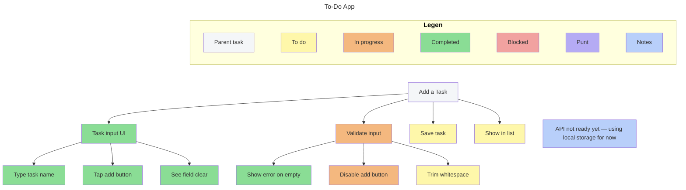

```mermaid
---
title: To-Do App
---
graph TD
    subgraph legend["Legend"]
        direction LR
        legend-parent-task["Parent task"] ~~~ legend-todo["To do"] ~~~ legend-in-progress["In progress"] ~~~ legend-completed["Completed"] ~~~ legend-blocked["Blocked"] ~~~ legend-punt["Punt"] ~~~ legend-notes["Notes"]
    end

    parent-node["Add a Task"]

    legend ~~~ parent-node

    parent-node --> task-input-ui["Task input UI"]
    parent-node --> validate-input["Validate input"]
    parent-node --> save-task["Save task"]
    parent-node --> show-in-list["Show in list"]

    task-input-ui --> type-task-name["Type task name"]
    task-input-ui --> tap-add-button["Tap add button"]
    task-input-ui --> see-field-clear["See field clear"]

    validate-input --> show-error-on-empty["Show error on empty"]
    validate-input --> disable-add-button["Disable add button"]
    validate-input --> trim-whitespace["Trim whitespace"]

    note-1["API not ready yet — using local storage for now"]
    parent-node ~~~ note-1

    classDef parent-task fill:#f4f6f8
    classDef todo fill:#fef7aa
    classDef in-progress fill:#f4b87f
    classDef completed fill:#8add95
    classDef blocked fill:#f1a2a0
    classDef punt fill:#b5abf4
    classDef notes fill:#b8cffa

    style legend color:#000000,font-size:18px,font-weight:bold

    class legend-parent-task parent-task
    class legend-todo todo
    class legend-in-progress in-progress
    class legend-completed completed
    class legend-blocked blocked
    class legend-punt punt
    class legend-notes notes

    class parent-node parent-task
    class task-input-ui completed
    class type-task-name completed
    class tap-add-button completed
    class see-field-clear completed
    class validate-input in-progress
    class show-error-on-empty completed
    class disable-add-button in-progress
    class trim-whitespace todo
    class save-task todo
    class show-in-list todo
    class note-1 notes
```
